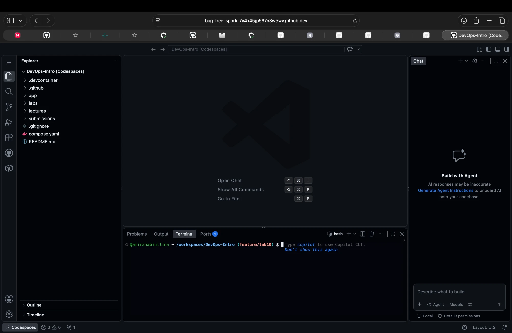
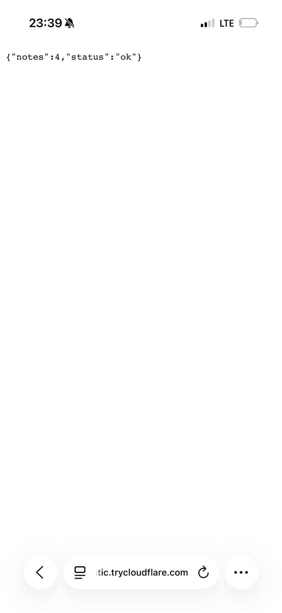

# Lab 10 — Cloud Computing: Ship QuickNotes to a Real Cloud

The deployed image is the Lab 9 hardened build (Go 1.26.9 + security-headers middleware). Branch `feature/lab10` is based on `feature/lab9`.

## Task 1 — CI-Automated Push to ghcr.io

### Release workflow

[`.github/workflows/release.yml`](../.github/workflows/release.yml)

```yaml
name: Release

on:
  push:
    tags:
      - "v*"

permissions:
  contents: read

jobs:
  release:
    name: build & push to ghcr.io
    runs-on: ubuntu-24.04
    permissions:
      contents: read
      packages: write

    steps:
      - name: Checkout repository
        uses: actions/checkout@3d3c42e5aac5ba805825da76410c181273ba90b1 # v7.0.1

      - name: Set up Docker Buildx
        uses: docker/setup-buildx-action@f87e5991a6d7451dcb8d9637bfbc97413f497069 # v4.4.1

      - name: Log in to ghcr.io
        uses: docker/login-action@dbcb813823bdd20940b903addbd779551569679f # v4.6.0
        with:
          registry: ghcr.io
          username: ${{ github.actor }}
          password: ${{ secrets.GITHUB_TOKEN }}

      - name: Extract image metadata
        id: meta
        uses: docker/metadata-action@dc802804100637a589fabce1cb79ff13a1411302 # v6.2.0
        with:
          images: ghcr.io/${{ github.repository }}/quicknotes
          tags: |
            type=ref,event=tag
            type=raw,value=latest

      - name: Build and push
        uses: docker/build-push-action@c3c9e263c25d99ce0380d002d59b67737d91b0dc # v7.4.0
        with:
          context: ./app
          platforms: linux/amd64
          push: true
          tags: ${{ steps.meta.outputs.tags }}
          labels: ${{ steps.meta.outputs.labels }}
          cache-from: type=gha
          cache-to: type=gha,mode=max
```

- Triggered only by `v*` tags.
- Only the job gets `packages: write`; the workflow default is `contents: read`.
- All actions are pinned by a 40-char SHA.
- `linux/amd64` because cloud hosts run amd64.

### Release

```bash
git tag -a -s v0.1.0 -m "Lab 10 release"
git push origin v0.1.0
```

Green release run: https://github.com/amiranabiullina/DevOps-Intro/actions/runs/37834768663

Image: `ghcr.io/amiranabiullina/devops-intro/quicknotes:v0.1.0` (+ `:latest`)

### Clean pull

After `docker logout ghcr.io` and `docker rmi` ([full log](lab10-evidence/clean-pull.txt)):

```text
Digest: sha256:b967859349a6d40e416d7e4d3667c01afa1e53f12f3cfe4f54519cb2a2d1b56f
Status: Downloaded newer image for ghcr.io/amiranabiullina/devops-intro/quicknotes:v0.1.0

Digest: sha256:b967859349a6d40e416d7e4d3667c01afa1e53f12f3cfe4f54519cb2a2d1b56f
Status: Downloaded newer image for ghcr.io/amiranabiullina/devops-intro/quicknotes:latest
```

The image is pullable without auth. `v0.1.0` and `latest` point to the same digest.

### Design questions

#### a) OIDC vs `GITHUB_TOKEN`

`GITHUB_TOKEN` only works inside GitHub, so it is enough for pushing to this repo's ghcr.io package. OIDC is needed when the workflow talks to something outside GitHub (AWS ECR, GCP, Azure, Vault, keyless Cosign signing). The job gets a short-lived signed token with claims (repo, ref, workflow), and the cloud trades it for credentials that expire in minutes. No long-lived secret is stored, and access can be limited to e.g. "only tags of this repo".

#### b) Why ship `:latest` next to `:v0.1.0`?

`:latest` is a convenience pointer for humans, docs and quick `docker run`. Deployments use the immutable `:v0.1.0` (or the digest). Both point to the same digest at release time; only `:latest` moves on the next release.

#### c) Why only `packages: write`?

Least privilege. If a step in the job is compromised (a hijacked action or a malicious dependency), a `write-all` token would let the attacker push to `main`, change workflows or create releases. With `packages: write` the worst case is a bad image, which is limited and visible as a new digest. The source code and workflows stay safe.

---

## Task 2 — Deploy to Codespaces (Option B)

Render asked for card verification at signup, and Russian cards fail there. As the lab says, I switched to **Option B — GitHub Codespaces**.

### devcontainer.json

[`.devcontainer/devcontainer.json`](../.devcontainer/devcontainer.json) (copy + commands in [`cloud/devcontainer.md`](../cloud/devcontainer.md)):

```json
{
  "name": "QuickNotes (Lab 10)",
  "image": "mcr.microsoft.com/devcontainers/base:ubuntu-24.04",
  "features": {
    "ghcr.io/devcontainers/features/docker-in-docker:2": {}
  },
  "forwardPorts": [8080],
  "portsAttributes": {
    "8080": { "label": "QuickNotes", "onAutoForward": "silent" }
  },
  "postStartCommand": "bash -c 'until docker info >/dev/null 2>&1; do sleep 1; done; docker rm -f quicknotes >/dev/null 2>&1; docker run -d --name quicknotes -p 8080:8080 -e ADDR=:8080 -e DATA_PATH=/data/notes.json -e SEED_PATH=/app/seed.json -v quicknotes-data:/data ghcr.io/amiranabiullina/devops-intro/quicknotes:v0.1.0'"
}
```

- `docker-in-docker` provides Docker, which the base image does not have.
- `postStartCommand` starts the `v0.1.0` image from ghcr.io on every codespace start.

### Public URL

https://bug-free-spork-7v4x45jp597x3w5wv-8080.app.github.dev

```text
$ gh codespace ports -c bug-free-spork-7v4x45jp597x3w5wv
QuickNotes      8080    public  https://bug-free-spork-7v4x45jp597x3w5wv-8080.app.github.dev
```

`curl -v` against `/health` ([full log](lab10-evidence/codespace-curl-health.txt)):

```text
> GET /health HTTP/2
< HTTP/2 200
< content-type: application/json
< x-content-type-options: nosniff
< content-security-policy: default-src 'none'; frame-ancestors 'none'
< x-frame-options: DENY
< x-served-by: tunnels-prod-rel-euw-v3-cluster
{"notes":4,"status":"ok"}
```

`/notes` returned the 4 seed notes. The Lab 9 security headers are still present.



### Warm latency

5 consecutive requests to `/health`:

```text
0.568468
0.597015
0.490460
0.924166
0.772525
warm p50: 0.597015s
```

### Cold start

A stopped codespace does not wake on a request, so each run was: `gh codespace stop` → curl the URL → start the codespace → time until `/health` returns 200 ([log](lab10-evidence/cold.txt)).

| Run | Stopped codespace returns | Time to 200 |
|-----|---------------------------|------------:|
| 1 | `HTTP/2 502`, empty body | 36 s |
| 2 | `HTTP/2 502`, empty body | 29 s |
| 3 | `HTTP/2 502`, empty body | 35 s |

After a restart, port 8080 went back to **private** (`302` to the GitHub login page). The measuring script re-applies `gh codespace ports visibility 8080:public` while waiting.

### Note persistence

```text
POST /notes → {"id":5,"title":"lab10 persistence test",...}
GET /health → {"notes":5,"status":"ok"}

# gh codespace stop → start

GET /health  → {"notes":5,"status":"ok"}
GET /notes/5 → {"id":5,"title":"lab10 persistence test","body":"created before codespace stop",...}
```

The note **survived** the stop/start.

### Design questions

#### d) Stopped codespace vs Render spin-down: which one wakes on a request?

Render does: its router holds the request, starts the instance and then forwards the request. A stopped codespace does not: it returned `502` until I started it manually. That is the line between them. A hosting platform starts the app because of traffic; a dev environment only starts when the developer opens it.

#### e) Why do GitHub's terms forbid production hosting on Codespaces?

Codespaces are personal dev machines with a free quota. Using them as public hosting is abuse of free compute. There is also no SLA: the URL belongs to one user, port visibility resets on restart, and the codespace stops after 30 min idle and never starts by itself. For production QuickNotes would need an always-on host with auto-restart on failed health checks, a stable domain, storage with backups, monitoring (Lab 8) and more than one replica.

#### f) Where did the note go?

It stayed in `/data/notes.json` in the named volume `quicknotes-data`. With docker-in-docker this volume lives on the codespace disk, which is kept on stop; on start the container is recreated with the same volume. On Render the free filesystem is ephemeral, so the note would be lost after spin-down. On Codespaces it is only lost after `gh codespace delete`.

---

## Bonus Task — Cloudflare Tunnel

### Setup

Commands in [`cloud/tunnel.md`](../cloud/tunnel.md):

```bash
docker run -d --name qn-tunnel --platform linux/amd64 -p 8090:8080 \
  -e DATA_PATH=/data/notes.json -e SEED_PATH=/app/seed.json \
  ghcr.io/amiranabiullina/devops-intro/quicknotes:v0.1.0

cloudflared tunnel --protocol http2 --url http://localhost:8090
```

The same `v0.1.0` image runs locally on port 8090 (8080 is used by the Lab 8 stack). The default QUIC protocol was blocked by my VPN (Error 1033), so I used `--protocol http2`.

URL: `https://print-kevin-glen-authentic.trycloudflare.com/health` → `{"notes":4,"status":"ok"}`

### Verification from another network

Opened from a phone on LTE (Wi-Fi off):



### Comparison

`hyperfine --runs 50 --warmup 3 -N "curl -s -o /dev/null <url>/health"` for both targets ([summary](lab10-evidence/latency-summary.txt)):

```text
tunnel n=50 p50=544ms p95=1045ms
codespace n=50 p50=559ms p95=1570ms
```

| Metric | Codespace | Cloudflare Tunnel (local-via-edge) |
|--------|----------:|-----------------------------------:|
| Warm p50 | 559 ms | 544 ms |
| Warm p95 | 1570 ms | 1045 ms |
| Cold start | 29–36 s (manual start) | N/A (continuously local) |
| Public URL stability | stable | ephemeral on restart |
| Cost | free | free |

### Design questions

#### g) Which one is "really cloud"?

The codespace: the container runs in GitHub's datacenter and keeps working when my laptop is off. With the tunnel only the entry point is cloud (Cloudflare edge, TLS); the app runs on my laptop. Users don't notice the difference while it works, but the tunnel goes down as soon as the laptop sleeps.

#### h) What dominates warm latency?

The app itself answers in microseconds. Each hyperfine run starts a new `curl`, so every sample pays for DNS, TCP and TLS over my VPN. Codespace: the slow part is the extra hop through GitHub's port-forwarding relay (`tunnels-prod-rel-euw`), which also shows in the higher p95. Tunnel: the slow part is the last leg from the Cloudflare edge back to my laptop over my home internet and VPN.

#### i) When is Cloudflare Tunnel the right production pick?

When the server has no public IP or must not open inbound ports: home labs, on-prem services, internal tools behind Cloudflare Access, webhook testing, and preview links for stakeholders. For production use a named tunnel with your own domain. It is never right as a quick tunnel (random URL, no SLA), with a laptop as the server, or when you need to scale: the tunnel only forwards traffic and adds no compute.

---

## Teardown

See [`cloud/teardown.md`](../cloud/teardown.md).
