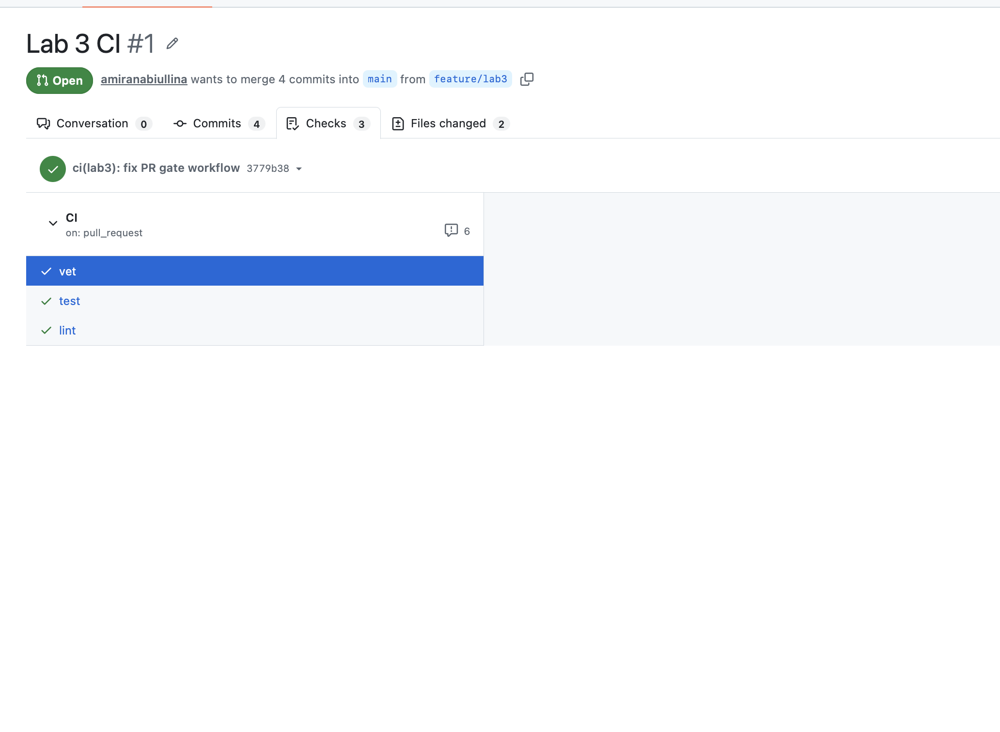
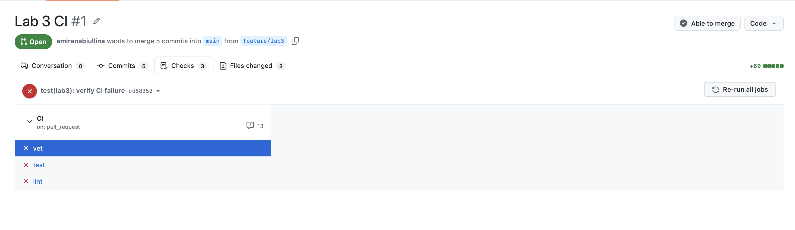
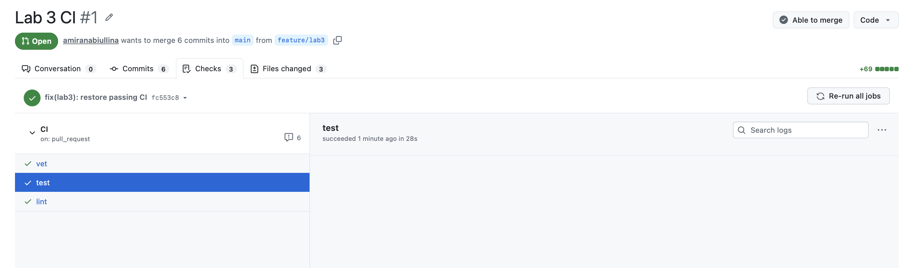

# Lab 3 Submission

## Selected CI/CD Path

Selected path: **GitHub Actions**

GitHub Actions was selected because the repository is hosted on GitHub and provides direct integration with pull requests, checks, and branch protection.

---

# Task 1 — PR-gated CI pipeline

## CI Workflow

Implemented CI workflow:

`.github/workflows/ci.yml`

The workflow:

- triggers on push to `main`
- triggers on pull requests targeting `main`
- runs three independent jobs:
  - `vet`
  - `test`
  - `lint`

Configuration includes:

- pinned Ubuntu runner version
- pinned GitHub Actions
- workflow permissions:

```yaml
permissions:
  contents: read
```

---

## Green CI Run

Successful CI run:

https://github.com/amiranabiullina/DevOps-Intro/actions

Passed checks:

- vet
- test
- lint

Screenshot:



---

## Failed CI Run and Fix

A deliberate failure was introduced to verify that the PR gate blocks broken changes.

The failing change caused CI checks to become red.

Screenshot:



The issue was reverted with a follow-up commit, after which the CI became green again.

Screenshot:



---

## Branch Protection

Branch protection was configured for the fork's `main` branch.

Enabled:

- Require status checks to pass before merging
- Require branches to be up to date before merging

Required checks:

- vet
- test
- lint

Screenshot:


---

# Task 2 — Make It Fast and Smart

## Cache

Added caching for:

- Go module cache
- Go build cache

Cached paths:

```
~/go/pkg/mod
~/.cache/go-build
```

The cache stores deterministic inputs and build cache data to reduce repeated work between CI runs.

---

## Go Version Matrix

Added matrix testing for:

- Go 1.23
- Go 1.24

The matrix is applied to:

- vet
- test

`fail-fast: false` is enabled so all combinations can finish and show their results.

---

## Path Filtering

Configured the workflow to run only when:

- `app/**` changes
- `.github/workflows/ci.yml` changes

Documentation-only changes do not trigger CI.

---

## CI Timing Measurements

| Scenario | Wall-clock |
|----------|-----------:|
| Baseline (no cache, single Go version, no path filter) | 32s |
| With cache | 35s |
| With cache + matrix | 39s |

The cache did not significantly improve the total runtime because QuickNotes has no third-party Go dependencies. Most of the runtime comes from runner setup and toolchain preparation.

---

# Design Questions

## a) Why pin the runner version instead of using ubuntu-latest?

A fixed runner version improves reproducibility.

`ubuntu-latest` can change when GitHub updates the runner image, which may introduce unexpected environment changes and break previously working pipelines.

---

## b) Why split vet, test, and lint into separate units?

Separate jobs provide clearer CI results and easier debugging.

If all checks were combined into one job, it would be harder to identify which validation step failed. Independent jobs also allow better parallel execution.

---

## c) What attack does SHA pinning prevent?

SHA pinning protects against supply-chain attacks where a referenced GitHub Action changes after being trusted.

Pinning a specific commit ensures that the workflow always executes the reviewed action version instead of an unexpectedly modified tag.

---

## d) What is permissions and what principle does it follow?

`permissions` defines what access a GitHub Actions workflow has to repository resources.

The principle is least privilege: a workflow should receive only the minimum permissions required.

This workflow uses:

```yaml
permissions:
  contents: read
```

because the CI pipeline only needs to read repository contents.

---

## e) Stage vs job

GitLab CI uses stages to define execution phases, while jobs are individual tasks executed inside stages.

GitHub Actions does not use stages directly; jobs are independent execution units inside a workflow.

---

# Task 2 Design Questions

## f) Why cache go.sum-keyed inputs and not build outputs?

Dependencies described by `go.sum` are deterministic inputs and can be safely reused.

Build outputs may depend on the environment, compiler version, and other factors, so caching inputs is more reliable.

---

## g) What does fail-fast: false change?

With `fail-fast: false`, one failed matrix job does not cancel the remaining matrix jobs.

This is useful when we want to see all failing combinations.

`fail-fast: true` is useful when quick feedback is more important and remaining jobs are not needed after a failure.

---

## h) What is the risk of malicious cache writes?

A malicious pull request could attempt to populate a cache with unsafe content.

If protected branches later restore this cache, the attacker-controlled data could affect the CI environment.

Cache keys, permissions, and GitHub security mechanisms help reduce this risk.
