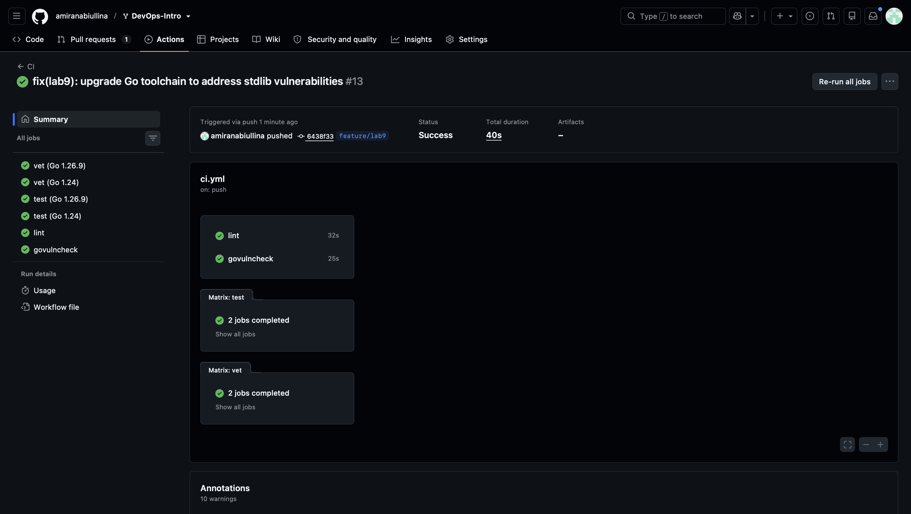
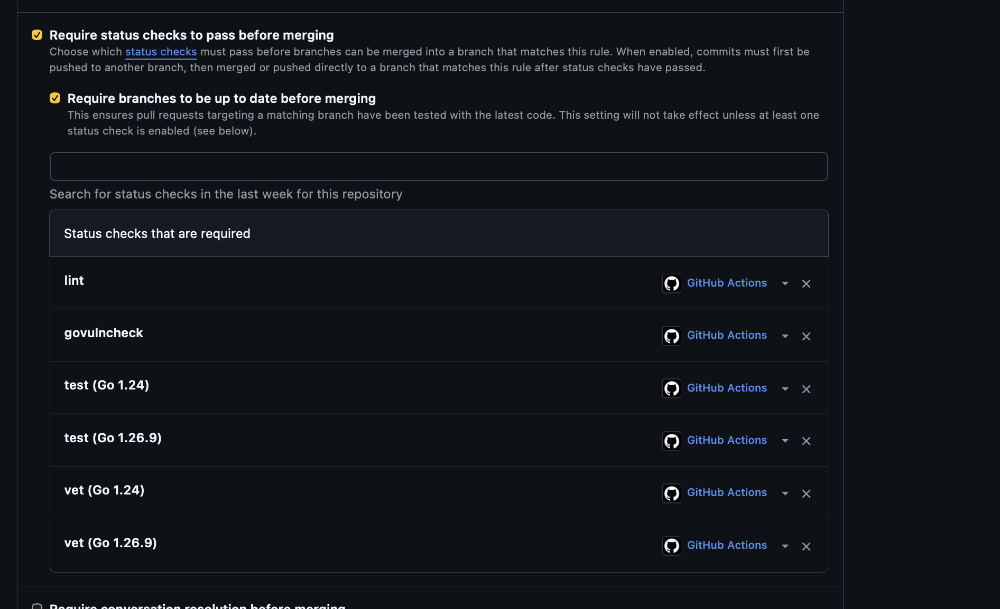

# Lab 9 — DevSecOps: QuickNotes

## Task 1 — Trivy

### Image identity and remediation

The initial image was `sha256:8c5e02774b09e23f06eb1bd07dd934b03cee121c72008a3c0d041f0d2e4f80c6`. It contained `app/quicknotes` and `app/healthcheck`, both built with Go 1.24.13. That locally available image had previously been built with the optional healthcheck binary; switching Git branches did not change it.

The final image was rebuilt from the current Lab 6-based Dockerfile. It contains only `app/quicknotes`; the separate Compose curl service provides the Lab 6 health polling. The older healthcheck binary is absent from the final image. Both old and new images use the tag `quicknotes:lab6`, so their identities and reports must be distinguished.

Final image ID recorded in the SBOM: `sha256:3a5a1ab232e49a40b2055bf3867bd5140a8de5c311c24819b04c2cbab0b7d6e0`.

The main binary was rebuilt with Go 1.26.9 in [6438f33](https://github.com/amiranabiullina/DevOps-Intro/commit/6438f33). The original report is retained as before evidence; the single submitted SBOM describes the final image.

### Commands and output excerpts

Commands below run from the repository root. Image and filesystem scans select HIGH and CRITICAL. The configuration scan keeps all severities. The filesystem scan includes the local `.venv`; the configuration scan excludes it. Reports and `.git` are excluded from repository scans to avoid scanning generated evidence and Git internals.

```bash
docker run --rm \
  -v /var/run/docker.sock:/var/run/docker.sock \
  -v trivy-cache:/root/.cache/ \
  aquasec/trivy:0.59.1 image --image-src docker \
  --scanners vuln --severity HIGH,CRITICAL --timeout 15m quicknotes:lab6

docker run --rm \
  -v "$PWD:/repo:ro" -v trivy-cache:/root/.cache/ \
  aquasec/trivy:0.59.1 fs --scanners vuln --severity HIGH,CRITICAL \
  --skip-dirs /repo/.git --skip-dirs /repo/submissions/lab9-reports \
  --timeout 15m /repo

docker run --rm \
  -v "$PWD:/repo:ro" -v trivy-cache:/root/.cache/ \
  aquasec/trivy:0.59.1 config \
  --skip-dirs /repo/.git --skip-dirs /repo/.venv \
  --skip-dirs /repo/submissions/lab9-reports --timeout 15m /repo

docker run --rm \
  -v /var/run/docker.sock:/var/run/docker.sock \
  -v trivy-cache:/root/.cache/ \
  -v "$PWD/submissions/lab9-reports:/reports" \
  aquasec/trivy:0.59.1 image --image-src docker --format cyclonedx \
  --timeout 15m --output /reports/quicknotes.sbom.cdx.json quicknotes:lab6
```

These are reproduction commands; saved reports contain the actual recorded results. For Trivy 0.59.1, image-to-SBOM generation uses `trivy image --format cyclonedx`; `trivy sbom` scans an existing SBOM. The INFO message about disabled security scanning during SBOM generation is expected: vulnerability scanning was performed separately.

Initial image output ([full report](lab9-reports/trivy-image-before.txt)):

```text
quicknotes:lab6 (debian 13.7)
=============================
Total: 0 (HIGH: 0, CRITICAL: 0)


app/healthcheck (gobinary)
==========================
Total: 19 (HIGH: 19, CRITICAL: 0)
```

Final image output ([full report](lab9-reports/trivy-image-after.txt)):

```text
2026-10-08T19:18:47Z INFO Detected OS family="debian" version="13.7"
2026-10-08T19:18:47Z INFO Number of language-specific files num=1
2026-10-08T19:18:47Z INFO [gobinary] Detecting vulnerabilities...

quicknotes:lab6 (debian 13.7)
=============================
Total: 0 (HIGH: 0, CRITICAL: 0)
```

Filesystem output ([full report](lab9-reports/trivy-fs.txt)):

```text
2026-10-08T11:45:12Z	INFO	[vuln] Vulnerability scanning is enabled
2026-10-08T11:45:17Z	WARN	[pip] Unable to find python `site-packages` directory. License detection is skipped.	err="unable to find path to Python executable"
2026-10-08T11:45:17Z	INFO	Suppressing dependencies for development and testing. To display them, try the '--include-dev-deps' flag.
2026-10-08T11:45:17Z	INFO	Number of language-specific files	num=16
2026-10-08T11:45:17Z	INFO	[poetry] Detecting vulnerabilities...
2026-10-08T11:45:17Z	INFO	[pip] Detecting vulnerabilities...
2026-10-08T11:45:17Z	INFO	[yarn] Detecting vulnerabilities...
2026-10-08T11:45:17Z	INFO	[pipenv] Detecting vulnerabilities...
2026-10-08T11:45:17Z	INFO	[gomod] Detecting vulnerabilities...
2026-10-08T11:45:17Z	INFO	[python-pkg] Detecting vulnerabilities...

.venv/lib/python3.11/site-packages/ansible_collections/azure/azcollection/requirements.txt (pip)
================================================================================================
Total: 1 (HIGH: 1, CRITICAL: 0)
```

The Python license-detection warning limits license coverage; it does not cancel the recorded vulnerability findings. Development/test dependencies were suppressed where the scanner identifies them; this is not an exhaustive scan of every optional development dependency.

Configuration output ([full report, including rule-loading errors](lab9-reports/trivy-config.txt)):

```text
2026-10-08T11:51:53Z INFO [misconfig] Misconfiguration scanning is enabled
2026-10-08T11:51:53Z INFO [misconfig] Need to update the built-in checks
2026-10-08T11:51:53Z INFO [misconfig] Downloading the built-in checks...
2026-10-08T11:51:58Z ERROR [rego] Failed to find embedded check, skipping
  file_path="root/.cache/trivy/policy/content/policies/cloud/policies/aws/ec2/specify_ami_owners.rego"
2026-10-08T11:51:58Z INFO Detected config files num=1

app/Dockerfile (dockerfile)
===========================
Tests: 28 (SUCCESSES: 27, FAILURES: 1)
Failures: 1 (UNKNOWN: 0, LOW: 1, MEDIUM: 0, HIGH: 0, CRITICAL: 0)
AVD-DS-0026 (LOW): Add HEALTHCHECK instruction in your Dockerfile
```

Only the Dockerfile was detected in this run; this report does not establish Compose misconfiguration coverage. A downloaded AWS EC2 policy was incompatible with the pinned scanner and was skipped; Dockerfile evaluation still completed. This limitation is recorded rather than treating the entire repository as fully checked.

SBOM-generation console excerpt:

```text
2026-10-08T19:19:01Z INFO "--format cyclonedx" disables security scanning. Specify "--scanners vuln" explicitly if you want to include vulnerabilities in the "cyclonedx" report.
2026-10-08T19:19:01Z INFO Detected OS family="debian" version="13.7"
2026-10-08T19:19:01Z INFO Number of language-specific files num=1
```

First 30 lines of the [final CycloneDX SBOM](lab9-reports/quicknotes.sbom.cdx.json):

```json
{
  "$schema": "http://cyclonedx.org/schema/bom-1.6.schema.json",
  "bomFormat": "CycloneDX",
  "specVersion": "1.6",
  "serialNumber": "urn:uuid:2f146e0d-3aaa-4385-bbd7-81a316fa47d7",
  "version": 1,
  "metadata": {
    "timestamp": "2026-10-08T19:19:01+00:00",
    "tools": {
      "components": [
        {
          "type": "application",
          "group": "aquasecurity",
          "name": "trivy",
          "version": "0.59.1"
        }
      ]
    },
    "component": {
      "bom-ref": "pkg:oci/quicknotes@sha256%3A3a5a1ab232e49a40b2055bf3867bd5140a8de5c311c24819b04c2cbab0b7d6e0?arch=arm64&repository_url=index.docker.io%2Flibrary%2Fquicknotes",
      "type": "container",
      "name": "quicknotes:lab6",
      "purl": "pkg:oci/quicknotes@sha256%3A3a5a1ab232e49a40b2055bf3867bd5140a8de5c311c24819b04c2cbab0b7d6e0?arch=arm64&repository_url=index.docker.io%2Flibrary%2Fquicknotes",
      "properties": [
        {
          "name": "aquasecurity:trivy:DiffID",
          "value": "sha256:167e43bbf2198c1b689b2d4283e4d8bdfbdfcc3400357b63e704415cc6520cc1"
        },
        {
          "name": "aquasecurity:trivy:DiffID",
```

### Image vulnerability triage

Every row below covers both initial occurrences: `app/quicknotes` and `app/healthcheck`, package `stdlib@v1.24.13`. All 19 IDs are HIGH. For the main application, the fix is rebuilding with Go 1.26.9; for the old healthcheck binary, the fix is removal from the rebuilt image. This does not claim that the removed binary was patched. The final image scan reports no HIGH/CRITICAL findings.

| ID | Severity | Disposition | Reason and evidence |
|---|---|---|---|
| CVE-2026-25679 | HIGH | FIX | Main binary rebuilt with Go 1.26.9; old healthcheck binary absent. [6438f33](https://github.com/amiranabiullina/DevOps-Intro/commit/6438f33); [after scan](lab9-reports/trivy-image-after.txt). |
| CVE-2026-27145 | HIGH | FIX | Main binary rebuilt with Go 1.26.9; old healthcheck binary absent. [6438f33](https://github.com/amiranabiullina/DevOps-Intro/commit/6438f33); [after scan](lab9-reports/trivy-image-after.txt). |
| CVE-2026-32280 | HIGH | FIX | Main binary rebuilt with Go 1.26.9; old healthcheck binary absent. [6438f33](https://github.com/amiranabiullina/DevOps-Intro/commit/6438f33); [after scan](lab9-reports/trivy-image-after.txt). |
| CVE-2026-32281 | HIGH | FIX | Main binary rebuilt with Go 1.26.9; old healthcheck binary absent. [6438f33](https://github.com/amiranabiullina/DevOps-Intro/commit/6438f33); [after scan](lab9-reports/trivy-image-after.txt). |
| CVE-2026-32283 | HIGH | FIX | Main binary rebuilt with Go 1.26.9; old healthcheck binary absent. [6438f33](https://github.com/amiranabiullina/DevOps-Intro/commit/6438f33); [after scan](lab9-reports/trivy-image-after.txt). |
| CVE-2026-33811 | HIGH | FIX | Main binary rebuilt with Go 1.26.9; old healthcheck binary absent. [6438f33](https://github.com/amiranabiullina/DevOps-Intro/commit/6438f33); [after scan](lab9-reports/trivy-image-after.txt). |
| CVE-2026-33814 | HIGH | FIX | Main binary rebuilt with Go 1.26.9; old healthcheck binary absent. [6438f33](https://github.com/amiranabiullina/DevOps-Intro/commit/6438f33); [after scan](lab9-reports/trivy-image-after.txt). |
| CVE-2026-33818 | HIGH | FIX | Main binary rebuilt with Go 1.26.9; old healthcheck binary absent. [6438f33](https://github.com/amiranabiullina/DevOps-Intro/commit/6438f33); [after scan](lab9-reports/trivy-image-after.txt). |
| CVE-2026-39820 | HIGH | FIX | Main binary rebuilt with Go 1.26.9; old healthcheck binary absent. [6438f33](https://github.com/amiranabiullina/DevOps-Intro/commit/6438f33); [after scan](lab9-reports/trivy-image-after.txt). |
| CVE-2026-39821 | HIGH | FIX | Main binary rebuilt with Go 1.26.9; old healthcheck binary absent. [6438f33](https://github.com/amiranabiullina/DevOps-Intro/commit/6438f33); [after scan](lab9-reports/trivy-image-after.txt). |
| CVE-2026-39822 | HIGH | FIX | Main binary rebuilt with Go 1.26.9; old healthcheck binary absent. [6438f33](https://github.com/amiranabiullina/DevOps-Intro/commit/6438f33); [after scan](lab9-reports/trivy-image-after.txt). |
| CVE-2026-39836 | HIGH | FIX | Main binary rebuilt with Go 1.26.9; old healthcheck binary absent. [6438f33](https://github.com/amiranabiullina/DevOps-Intro/commit/6438f33); [after scan](lab9-reports/trivy-image-after.txt). |
| CVE-2026-42499 | HIGH | FIX | Main binary rebuilt with Go 1.26.9; old healthcheck binary absent. [6438f33](https://github.com/amiranabiullina/DevOps-Intro/commit/6438f33); [after scan](lab9-reports/trivy-image-after.txt). |
| CVE-2026-42504 | HIGH | FIX | Main binary rebuilt with Go 1.26.9; old healthcheck binary absent. [6438f33](https://github.com/amiranabiullina/DevOps-Intro/commit/6438f33); [after scan](lab9-reports/trivy-image-after.txt). |
| CVE-2026-56853 | HIGH | FIX | Main binary rebuilt with Go 1.26.9; old healthcheck binary absent. [6438f33](https://github.com/amiranabiullina/DevOps-Intro/commit/6438f33); [after scan](lab9-reports/trivy-image-after.txt). |
| CVE-2026-56858 | HIGH | FIX | Main binary rebuilt with Go 1.26.9; old healthcheck binary absent. [6438f33](https://github.com/amiranabiullina/DevOps-Intro/commit/6438f33); [after scan](lab9-reports/trivy-image-after.txt). |
| CVE-2026-56859 | HIGH | FIX | Main binary rebuilt with Go 1.26.9; old healthcheck binary absent. [6438f33](https://github.com/amiranabiullina/DevOps-Intro/commit/6438f33); [after scan](lab9-reports/trivy-image-after.txt). |
| CVE-2026-56860 | HIGH | FIX | Main binary rebuilt with Go 1.26.9; old healthcheck binary absent. [6438f33](https://github.com/amiranabiullina/DevOps-Intro/commit/6438f33); [after scan](lab9-reports/trivy-image-after.txt). |
| CVE-2026-56862 | HIGH | FIX | Main binary rebuilt with Go 1.26.9; old healthcheck binary absent. [6438f33](https://github.com/amiranabiullina/DevOps-Intro/commit/6438f33); [after scan](lab9-reports/trivy-image-after.txt). |

### Filesystem vulnerability triage

All seven affected paths share the prefix `.venv/lib/python3.11/site-packages/ansible_collections/`. The tables below use paths relative to that prefix and list every occurrence, including the same ID at different package versions or in different manifests.

The Docker build context is `app/`, and the runtime stage copies the application binary, seed JSON and data directory. It does not copy the repository `.venv`, Python, Node packages or these Ansible manifests. The [final SBOM](lab9-reports/quicknotes.sbom.cdx.json) describes the resulting runtime components.

These are real findings in bundled manifests, not automatically false positives. Manifest versions also need not equal the packages actually installed in the local environment. A read-only inspection of local `.dist-info` directories found `ansible-core 2.17.14`, `cryptography 50.0.2`, and `setuptools 80.9.0`, rather than several older versions named in the manifests. This is context, not proof that all local tooling is safe.

Decisions apply to this local lab environment. Before using these collection environments for deployment, installing their locked dependencies, or processing untrusted playbooks/data, re-evaluate and upgrade the relevant collection/dependencies. Do not hand-edit vendor lockfiles merely to silence the scanner. No findings were hidden with `.trivyignore`.

Reason codes used in each row:

- **A1:** Embedded Azure collection requirements, outside the QuickNotes build/runtime. Accept temporary local-manifest risk; review before using this collection or by **2026-11-08**.
- **A2:** Embedded DigitalOcean collection lockfile, outside the QuickNotes build/runtime. Accept temporary local-tooling risk; review before running this collection or by **2026-11-08**.
- **A3:** Zabbix Molecule test requirements, outside the QuickNotes build/runtime. Accept temporary test-environment risk; update before creating/running that environment or by **2026-11-08**.
- **A4:** Embedded Conjur tenant-tool lockfile, outside the QuickNotes build/runtime. Accept temporary risk for this lab; resolve the pinned authentication/crypto dependencies before using that tool or by **2026-10-15** (short review because CRITICAL findings are present).
- **A5:** Embedded Grafana collection Python lockfile, outside the QuickNotes build/runtime. Accept temporary collection-tooling risk; review before using this environment or by **2026-11-08**.
- **A6:** Embedded Grafana collection JavaScript lockfile, outside the QuickNotes build/runtime. Accept temporary tooling risk; review before installing/running these dependencies or by **2026-11-08**.
- **A7:** Embedded NetBox collection lockfile, outside the QuickNotes build/runtime. Accept temporary local-tooling risk; resolve before using the collection or by **2026-10-15** (includes a CRITICAL finding).
- **W1:** The recorded scan lists no fixed version for `ecdsa` / CVE-2024-23342. Watch the upstream advisory and replacement options; re-check by **2026-10-15**, and before enabling the Conjur tool.
- **W2:** The recorded scan lists no fixed version for `python-jose` / CVE-2026-85394. Watch the upstream fix or dependency replacement; re-check by **2026-10-15**, and before enabling the Conjur tool.
- **W3:** The recorded scan lists no fixed version for `braces` / CVE-2026-93687. Watch upstream release/advisory updates; re-check by **2026-10-15**, and before installing the affected JavaScript environment.

WATCH records the state of the captured scanner database, not a claim that upstream can never provide a fix.

#### azure/azcollection/requirements.txt (pip)

| Package | Manifest version | ID | Severity | Disposition | Reason / review |
|---|---|---|---|---|---|
| azure-core | 1.28.0 | CVE-2026-21226 | HIGH | ACCEPT | A1 |

#### community/digitalocean/poetry.lock (poetry)

| Package | Manifest version | ID | Severity | Disposition | Reason / review |
|---|---|---|---|---|---|
| ansible-core | 2.15.9 | CVE-2024-8775 | HIGH | ACCEPT | A2 |
| ansible-core | 2.15.9 | CVE-2026-11332 | HIGH | ACCEPT | A2 |
| cryptography | 42.0.4 | CVE-2026-26007 | HIGH | ACCEPT | A2 |
| cryptography | 42.0.4 | CVE-2026-69249 | HIGH | ACCEPT | A2 |
| cryptography | 42.0.4 | GHSA-537c-gmf6-5ccf | HIGH | ACCEPT | A2 |
| urllib3 | 1.26.18 | CVE-2025-66418 | HIGH | ACCEPT | A2 |
| urllib3 | 1.26.18 | CVE-2025-66471 | HIGH | ACCEPT | A2 |
| urllib3 | 1.26.18 | CVE-2026-21441 | HIGH | ACCEPT | A2 |
| urllib3 | 1.26.18 | CVE-2026-44431 | HIGH | ACCEPT | A2 |
| urllib3 | 1.26.18 | CVE-2026-97687 | HIGH | ACCEPT | A2 |
| urllib3 | 1.26.18 | CVE-2026-97689 | HIGH | ACCEPT | A2 |

#### community/zabbix/molecule/requirements.txt (pip)

| Package | Manifest version | ID | Severity | Disposition | Reason / review |
|---|---|---|---|---|---|
| ansible-core | 2.15.11 | CVE-2024-8775 | HIGH | ACCEPT | A3 |
| ansible-core | 2.15.11 | CVE-2026-11332 | HIGH | ACCEPT | A3 |

#### cyberark/conjur/conjur-cloud-tools/conjurCloudTenant/conjur_cloud_tenant/poetry.lock (poetry)

| Package | Manifest version | ID | Severity | Disposition | Reason / review |
|---|---|---|---|---|---|
| cryptography | 42.0.8 | CVE-2026-26007 | HIGH | ACCEPT | A4 |
| cryptography | 42.0.8 | CVE-2026-69249 | HIGH | ACCEPT | A4 |
| cryptography | 42.0.8 | GHSA-537c-gmf6-5ccf | HIGH | ACCEPT | A4 |
| ecdsa | 0.19.0 | CVE-2024-23342 | HIGH | WATCH | W1 |
| pyasn1 | 0.6.0 | CVE-2026-30922 | HIGH | ACCEPT | A4 |
| pyasn1 | 0.6.0 | CVE-2026-59884 | HIGH | ACCEPT | A4 |
| pyasn1 | 0.6.0 | CVE-2026-59885 | HIGH | ACCEPT | A4 |
| pyasn1 | 0.6.0 | CVE-2026-59886 | HIGH | ACCEPT | A4 |
| pyjwt | 2.8.0 | CVE-2026-102268 | CRITICAL | ACCEPT | A4 |
| pyjwt | 2.8.0 | CVE-2026-102267 | HIGH | ACCEPT | A4 |
| pyjwt | 2.8.0 | CVE-2026-102271 | HIGH | ACCEPT | A4 |
| pyjwt | 2.8.0 | CVE-2026-32597 | HIGH | ACCEPT | A4 |
| pyjwt | 2.8.0 | CVE-2026-48526 | HIGH | ACCEPT | A4 |
| python-jose | 3.3.0 | CVE-2024-33663 | CRITICAL | ACCEPT | A4 |
| python-jose | 3.3.0 | CVE-2026-85394 | CRITICAL | WATCH | W2 |
| urllib3 | 1.26.19 | CVE-2025-66418 | HIGH | ACCEPT | A4 |
| urllib3 | 1.26.19 | CVE-2025-66471 | HIGH | ACCEPT | A4 |
| urllib3 | 1.26.19 | CVE-2026-21441 | HIGH | ACCEPT | A4 |
| urllib3 | 1.26.19 | CVE-2026-44431 | HIGH | ACCEPT | A4 |
| urllib3 | 1.26.19 | CVE-2026-97687 | HIGH | ACCEPT | A4 |
| urllib3 | 1.26.19 | CVE-2026-97689 | HIGH | ACCEPT | A4 |

#### grafana/grafana/Pipfile.lock (pipenv)

| Package | Manifest version | ID | Severity | Disposition | Reason / review |
|---|---|---|---|---|---|
| ansible-core | 2.17.4 | CVE-2024-8775 | HIGH | ACCEPT | A5 |
| ansible-core | 2.17.4 | CVE-2026-11332 | HIGH | ACCEPT | A5 |
| black | 24.8.0 | CVE-2026-32274 | HIGH | ACCEPT | A5 |
| cryptography | 43.0.1 | CVE-2026-26007 | HIGH | ACCEPT | A5 |
| cryptography | 43.0.1 | CVE-2026-69249 | HIGH | ACCEPT | A5 |
| cryptography | 43.0.1 | GHSA-537c-gmf6-5ccf | HIGH | ACCEPT | A5 |
| setuptools | 69.0.3 | CVE-2024-6345 | HIGH | ACCEPT | A5 |
| setuptools | 69.0.3 | CVE-2025-47273 | HIGH | ACCEPT | A5 |

#### grafana/grafana/yarn.lock (yarn)

| Package | Manifest version | ID | Severity | Disposition | Reason / review |
|---|---|---|---|---|---|
| brace-expansion | 1.1.11 | CVE-2026-102276 | HIGH | ACCEPT | A6 |
| brace-expansion | 1.1.11 | CVE-2026-102278 | HIGH | ACCEPT | A6 |
| brace-expansion | 1.1.11 | CVE-2026-13149 | HIGH | ACCEPT | A6 |
| brace-expansion | 1.1.11 | CVE-2026-14257 | HIGH | ACCEPT | A6 |
| brace-expansion | 1.1.11 | CVE-2026-69152 | HIGH | ACCEPT | A6 |
| braces | 3.0.3 | CVE-2026-93687 | HIGH | WATCH | W3 |
| flatted | 2.0.2 | CVE-2026-32141 | HIGH | ACCEPT | A6 |
| flatted | 2.0.2 | CVE-2026-33228 | HIGH | ACCEPT | A6 |
| js-yaml | 3.14.1 | CVE-2026-59869 | HIGH | ACCEPT | A6 |
| js-yaml | 3.14.1 | CVE-2026-84375 | HIGH | ACCEPT | A6 |
| js-yaml | 3.14.1 | GHSA-5p4m-2wfm-xmqj | HIGH | ACCEPT | A6 |
| js-yaml | 4.1.0 | CVE-2026-59869 | HIGH | ACCEPT | A6 |
| js-yaml | 4.1.0 | CVE-2026-84375 | HIGH | ACCEPT | A6 |
| js-yaml | 4.1.0 | GHSA-5p4m-2wfm-xmqj | HIGH | ACCEPT | A6 |
| linkify-it | 4.0.1 | CVE-2026-48801 | HIGH | ACCEPT | A6 |
| linkify-it | 4.0.1 | CVE-2026-59887 | HIGH | ACCEPT | A6 |
| lodash | 4.17.21 | CVE-2026-4800 | HIGH | ACCEPT | A6 |
| minimatch | 3.1.2 | CVE-2026-26996 | HIGH | ACCEPT | A6 |
| minimatch | 3.1.2 | CVE-2026-27903 | HIGH | ACCEPT | A6 |
| minimatch | 3.1.2 | CVE-2026-27904 | HIGH | ACCEPT | A6 |
| picomatch | 2.3.1 | CVE-2026-33671 | HIGH | ACCEPT | A6 |
| yaml | 2.2.1 | CVE-2023-2251 | HIGH | ACCEPT | A6 |

#### netbox/netbox/poetry.lock (poetry)

| Package | Manifest version | ID | Severity | Disposition | Reason / review |
|---|---|---|---|---|---|
| aiohttp | 3.10.5 | CVE-2025-69223 | HIGH | ACCEPT | A7 |
| aiohttp | 3.10.5 | CVE-2026-69244 | HIGH | ACCEPT | A7 |
| ansible-core | 2.17.3 | CVE-2024-8775 | HIGH | ACCEPT | A7 |
| ansible-core | 2.17.3 | CVE-2026-11332 | HIGH | ACCEPT | A7 |
| black | 24.8.0 | CVE-2026-32274 | HIGH | ACCEPT | A7 |
| cryptography | 43.0.1 | CVE-2026-26007 | HIGH | ACCEPT | A7 |
| cryptography | 43.0.1 | CVE-2026-69249 | HIGH | ACCEPT | A7 |
| cryptography | 43.0.1 | GHSA-537c-gmf6-5ccf | HIGH | ACCEPT | A7 |
| deepdiff | 8.0.1 | CVE-2025-58367 | CRITICAL | ACCEPT | A7 |
| deepdiff | 8.0.1 | CVE-2026-33155 | HIGH | ACCEPT | A7 |
| urllib3 | 2.2.2 | CVE-2025-66418 | HIGH | ACCEPT | A7 |
| urllib3 | 2.2.2 | CVE-2025-66471 | HIGH | ACCEPT | A7 |
| urllib3 | 2.2.2 | CVE-2026-21441 | HIGH | ACCEPT | A7 |
| urllib3 | 2.2.2 | CVE-2026-44431 | HIGH | ACCEPT | A7 |
| urllib3 | 2.2.2 | CVE-2026-97687 | HIGH | ACCEPT | A7 |
| urllib3 | 2.2.2 | CVE-2026-97689 | HIGH | ACCEPT | A7 |

### Configuration triage

| ID / target | Severity | Disposition | Reason / review |
|---|---|---|---|
| AVD-DS-0026 / `app/Dockerfile` | LOW | ACCEPT | The Lab 6 Compose curl sidecar polls `/health`; the minimal runtime has no shell/curl. A sidecar is not equivalent to Docker's native health status for the application, so this is an accepted limitation, not a false positive. Re-evaluate by 2026-11-08 or before deploying to an environment requiring native container healthchecks. |

### Design questions a–d

**a) What matters beyond severity?** Reachability, attacker-controlled input, authentication requirements, exploitation evidence, affected configuration/platform, exposed interfaces, data sensitivity, mitigations and patch availability all affect priority. A high-severity flaw in a bundled development lockfile has a different runtime exposure from the same flaw in an internet-facing request handler, but still needs an explicit decision. The local Compose port is published on all host interfaces; localhost scan URLs do not prove that the service is network-isolated.

**b) Why does a minimal base help?** Fewer packages, utilities and interpreters mean fewer components to exploit and maintain. Distroless removes much of the general-purpose userland and reduces available post-exploitation tools. It does not remove vulnerabilities compiled into a Go binary: this lab's base had zero HIGH/CRITICAL findings while its Go standard library did not. Minimality is a strong preventive control, not a substitute for patching, non-root execution or correct application behavior.

**c) When is `.trivyignore` appropriate?** For a reviewed finding with evidence, a named scope, a documented reason and a review/expiry date, for example a verified non-applicable platform/configuration. Blanket severity suppression or hiding a reachable unpatched flaw solely to obtain green output is security theater. This submission uses documented dispositions and preserves raw reports instead of suppressing findings.

**d) What future problem does the SBOM solve?** When a new vulnerability is announced, an operator can search recorded component names and versions across deployed image identities to identify candidate affected releases without reconstructing their dependencies first. This supports a Log4Shell-style inventory response. The SBOM must be associated with an image digest, refreshed after rebuilds and combined with reachability/configuration analysis; its presence alone does not prove exploitability or safety.

## Task 2 — ZAP baseline and middleware

### Scan scope and artifacts

The scans used passive `zap-baseline.py`, never an active scan. QuickNotes is a JSON API whose root returns 404, so the crawl started at `http://localhost:8080/notes`. ZAP shared the application container's network namespace. The crawl reported five URLs and did not exercise all API methods or establish authenticated coverage.

```bash
docker run --rm \
  --network container:devops-intro-quicknotes-1 \
  -v "$PWD/submissions/lab9-reports:/zap/wrk:rw" \
  ghcr.io/zaproxy/zaproxy:2.16.1 \
  zap-baseline.py -t http://localhost:8080/notes -m 1 -T 5 \
  -r zap-after.html -J zap-after.json
```

The initial run used `zap-before.html` and `zap-before.json` as the report filenames.

- Before: [HTML](lab9-reports/zap-before.html), [JSON](lab9-reports/zap-before.json).
- After the header fix: [HTML](lab9-reports/zap-after.html), [JSON](lab9-reports/zap-after.json).

The saved ZAP after report is from the header-remediation stage, before the later Go toolchain rebuild. Following that rebuild, manual HTTP checks again returned 200 and all seven headers for `/health` and `/notes`; this is a smoke check, not a new ZAP scan.

### All ZAP findings

All URLs below use `http://localhost:8080`. Paths and parameters are taken from the JSON reports.

| ID / alert reference | Name | Risk | Affected path / parameter | Disposition | Reason / evidence |
|---|---|---|---|---|---|
| 10021 | X-Content-Type-Options Header Missing | LOW | `/notes`; `x-content-type-options` | FIX | Added `X-Content-Type-Options: nosniff` in router middleware; alert absent from after JSON. |
| 90004 / 90004-1 | Insufficient Site Isolation Against Spectre Vulnerability | LOW | `/notes`; `Cross-Origin-Resource-Policy` | FIX | Added `Cross-Origin-Resource-Policy: same-origin` and explicit COOP/COEP policies; alert absent from after JSON. |
| 10049 / 10049-3 | Storable and Cacheable Content | Informational | `/`, `/notes`; no parameter | FIX | Added `Cache-Control: no-store` to prevent storage of note responses; this subtype is absent after the fix. |
| 10116 | ZAP is Out of Date | LOW | `/`; no parameter (scanner-level observation) | ACCEPT | Pinned 2.16.1 is retained for comparable before/after lab scans. The report identifies 2.17.0 as newer. This limits scanner currency, not application behavior; re-evaluate by 2026-11-08 or before a production assessment. |
| 10049 / 10049-1 (after only) | Non-Storable Content | Informational | `/`, `/notes`, `/robots.txt`, `/sitemap.xml`; no parameter; evidence `no-store` | ACCEPT | This describes the intended cache policy, not failure to set it. Re-evaluate by 2026-11-08 or if caching requirements change. Removing `no-store` simply to remove this message would reverse the fix. |

The baseline finished with 65 PASS, 2 WARN and 0 FAIL; exit code 2 means warnings remain. ZAP's WARN result is not the same as its alert risk level: the non-storable-content alert is Informational. The spider warning for `/` returning 404 is expected for the current API routing; it limits discovery and is not evidence of a security vulnerability. No alerts were suppressed.

### Before/after evidence

Selected entries read from the saved JSON reports:

`zap-before.json`:

```text
90004-1: Insufficient Site Isolation Against Spectre Vulnerability — Low (Medium)
10021: X-Content-Type-Options Header Missing — Low (Medium)
10116: ZAP is Out of Date — Low (High)
10049-3: Storable and Cacheable Content — Informational (Medium)
```

`zap-after.json`:

```text
10116: ZAP is Out of Date — Low (High)
10049-1: Non-Storable Content — Informational (Medium)
```

### Code fix and test

Commit: [05521b8](https://github.com/amiranabiullina/DevOps-Intro/commit/05521b8). Source: [middleware](../app/security_headers.go), [router wiring](../app/handlers.go), [test](../app/security_headers_test.go).

`Routes()` returns `http.Handler` and wraps the completed mux with `securityHeaders(mux)`. A single middleware writes all seven headers before delegating to the router, covering normal responses and router-generated errors. The unit test uses the actual `Routes()` path and independent expected header literals for `/health`, `/notes`, `/metrics`, `/notes/999` and an unknown route. The last two return 404.

[Before test log](lab9-reports/header-test-before.txt) records missing `nosniff` on the initial four tested routes; [after test log](lab9-reports/header-test-after.txt) records passing tests after the middleware and expanded header assertions. Removing the router wrapper makes the assertions fail because the underlying handlers do not set these headers. The subsequent [Go 1.26.9 validation](lab9-reports/go-upgrade-check.txt) also passed `go vet ./...` and `go test -race -count=1 ./...`.

```diff
- func (s *Server) Routes() *http.ServeMux {
+ func (s *Server) Routes() http.Handler {
    // Route registration remains inside the mux.
-   return mux
+   return securityHeaders(mux)
  }
```

### Design questions e–g

**e) Why middleware?** It makes the policy consistent across all handlers and errors and prevents new routes from accidentally omitting a header. One wrapper and route-level regression tests are easier to maintain than duplicated header writes in each handler.

**f) What does a strict CSP break?** `default-src 'none'` blocks resource loading covered by CSP's default-source fallback, including scripts, styles, images, fonts and browser connections unless more specific directives allow them. A rendered website or Swagger UI would need a deliberately scoped policy. QuickNotes returns JSON rather than a resource-loading HTML application, so this policy is suitable for the current API. `frame-ancestors 'none'` separately prevents embedding; that directive does not inherit `default-src`.

**g) Why read informational findings?** An informational result can describe desired behavior, expose a coverage limitation, or point to something that becomes relevant in another deployment. Blanket acceptance loses that distinction and creates permanent exceptions without evidence or an expiry. A false positive means the reported condition is wrong; acceptance means the condition exists but its risk or behavior is acceptable in the documented context.

## Bonus — govulncheck PR gate

### Workflow and version decision

The [existing CI workflow](../.github/workflows/ci.yml), restored from Lab 3, contains a separate job and status check named `govulncheck`. It runs on pull requests to `main` that change the application or workflow; pushes to `feature/lab9` were enabled to capture the demonstration before submission. The job checks `app/` with `govulncheck ./...`, uses `GOTOOLCHAIN=local`, and does not ignore a failing exit code.

Go 1.24.13 initially reported 12 reachable standard-library findings. Reverting the demonstration dependency removed its additional finding, but did not fix those 12 findings. The build and scanner toolchain were therefore upgraded to Go 1.26.9; Go 1.24 remains in the vet/test compatibility matrix and in the module's minimum Go directive. This is an explicit deviation from the literal Go 1.24 scanner requirement in B.2, made to remediate the reported standard-library vulnerabilities. The green result required both reverting the dependency and updating Go; it is not represented as a revert-only success.

```yaml
jobs:
  govulncheck:
    name: govulncheck
    runs-on: ubuntu-24.04
    timeout-minutes: 10

    env:
      GOTOOLCHAIN: local

    defaults:
      run:
        working-directory: app

    steps:
      - name: Checkout repository
        uses: actions/checkout@v4

      - name: Set up Go
        uses: actions/setup-go@v5
        with:
          go-version: "1.26.9"
          cache: false

      - name: Install pinned govulncheck
        run: go install golang.org/x/vuln/cmd/govulncheck@v1.1.4

      - name: Check reachable vulnerabilities
        run: govulncheck ./...
```

### Red, revert and green evidence

| Stage | Commit / CI run | Result / evidence |
|---|---|---|
| Initial scanner on Go 1.24.13 | `05521b8`, CI #10 | 12 standard-library findings; [initial local log](lab9-reports/govulncheck-initial.txt) |
| Temporary reachable dependency | [7a0571a](https://github.com/amiranabiullina/DevOps-Intro/commit/7a0571a), CI #11 | `golang.org/x/text@v0.3.5` added and `language.Parse` called from `init()`; GO-2021-0113 appears at `vuln_demo.go:7:23`; [red CI log](lab9-reports/govulncheck-ci-red.txt) |
| Revert temporary dependency | [dc6e06e](https://github.com/amiranabiullina/DevOps-Intro/commit/dc6e06e), CI #12 | Dependency finding disappeared; 12 standard-library findings remained, so this run was still red |
| Upgrade build/scanner Go | [6438f33](https://github.com/amiranabiullina/DevOps-Intro/commit/6438f33), CI #13 | All six jobs green; [CI screenshot](lab9-reports/govulncheck-ci-green.png), [local test and scanner log](lab9-reports/go-upgrade-check.txt) |

The red CI excerpt identifies the added dependency independently of the pre-existing failures:

```text
Vulnerability #13: GO-2021-0113
    Out-of-bounds read in golang.org/x/text/language
  Module: golang.org/x/text
    Found in: golang.org/x/text@v0.3.5
    Fixed in: golang.org/x/text@v0.3.7
    Example traces found:
Error: #1: vuln_demo.go:7:23: quicknotes.init#1 calls language.Parse
Error: Process completed with exit code 3.
```

Green local validation excerpt (the separate CI screenshot proves the remote job also passed):

```text
go version go1.26.9 linux/arm64
ok      quicknotes      1.013s
No vulnerabilities found.
```



### Required status checks

The fork owner's `main` branch-protection rule was updated to require `govulncheck`, `lint`, `vet (Go 1.24)`, `vet (Go 1.26.9)`, `test (Go 1.24)` and `test (Go 1.26.9)`. The old `vet` and `test` names were replaced with the actual matrix check names. "Require branches to be up to date before merging" is enabled, and bypassing the settings is disabled. The screenshot below shows all six required checks and the enabled up-to-date requirement. The owner confirmed saving the rule and disabling bypass; the branch name and bypass option are outside this screenshot crop.



This rule controls PRs into `main` of `amiranabiullina/DevOps-Intro`. It does not configure protection in the course repository: whether the same check is mandatory for the final upstream submission PR is controlled by that repository's maintainers. A workflow failure alone is not equivalent to a required merge gate.

### Design questions h–j

**h) Why reachability?** A module-presence scanner reports known vulnerabilities in a dependency version even when the application never calls the affected functions. govulncheck uses package and call-graph information to distinguish symbol-reachable findings and show example call paths. That narrows the highest-priority triage queue and provides code locations for investigation. Static reachability is not proof that an attacker can exploit a particular deployment, and currently unreachable code can become reachable after future changes. The temporary `init()` call demonstrated a reachable affected function rather than merely adding an unused module.

**i) Why pin the scanner?** Pinning `govulncheck@v1.1.4` makes scanner code and behavior reviewable and prevents an unreviewed scanner release from changing the gate unexpectedly. The Go toolchain also influences analysis. Pinning the scanner does not freeze the vulnerability database: new advisories can legitimately turn a previously green scan red. Scanner updates should be deliberate and tested.

**j) What does govulncheck miss?** It does not inventory Debian packages, C libraries, JavaScript or Python dependencies in an image. Trivy's image scan can identify known vulnerabilities in supported OS and language components, including components that are not reachable from the Go application's call graph. govulncheck also does not replace Dockerfile misconfiguration checks or HTTP behavior checks; those are covered here by the separate Trivy configuration scan and ZAP baseline.

## References

- [Trivy 0.59 SBOM documentation](https://trivy.dev/docs/v0.59/supply-chain/sbom/)
- [ZAP baseline scan and exit codes](https://www.zaproxy.org/docs/docker/baseline-scan/)
- [ZAP non-storable-content alert](https://www.zaproxy.org/docs/alerts/10049-1/)
- [Go vulnerability-check tutorial](https://go.dev/doc/tutorial/govulncheck)
- [Go release history and support policy](https://go.dev/doc/devel/release)
- [GitHub branch protection](https://docs.github.com/en/repositories/configuring-branches-and-merges-in-your-repository/managing-protected-branches/managing-a-branch-protection-rule)
